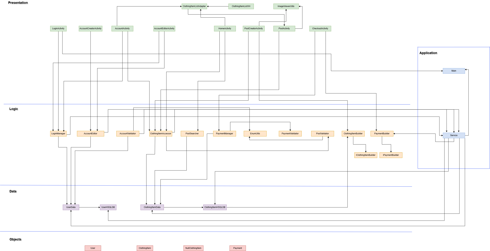

# Architecture of ReShop

## Application

- **Service**: instantiates persistent data objects that are used throughout the application.
- **Main**: instantiates data objects including the databases that are used throughout the application.

## Presentation

- **ClothingItemListAdapter**: manages list of ClothingItem objects that need to be displayed.
- **ClothingItemListVH**: fetches data from the ClothingItem to displayed in the RecyclerView format.
- **ImageViewerUtils**: displays the images of clothing items posted by various users.
- **LoginActivity**: displays the login portal and gives the option to create a new account.
- **AccountCreatorActivity**: displays a form to create a new user account.
- **AccountActivity**: displays the information of the user's account.
- **AccountEditorActivity**: manages and displays user's account information to be edited.
- **HomeActivity**: displays the list of clothing items that are available for sell and handles the search bar for easy navigation.
- **PostCreatorActivity**: displays a form to create a new post to sell a clothing item.
- **PostActivity**: displays the information of a post.
- **CheckoutActivity**: displays the checkout details the user needs to fill before purchasing the clothing item.

## Logic

- **LoginManager**: manages the login information of the user.
- **AccountEditor**: retrieves the user information to be displayed or edited and the user's account page.
- **AccountValidator**: validates the information of the new user like username, password, and display name.
- **ClothingItemAccessor**: validates and manages the retrieval, insertion and deletion of a clothing item.
- **PostSearcher**: filters clothing items based on the user's search input.
- **PaymentManager**: checks the user's information such as card details, address and phone number before checking out.
- **EnumUtils**: checks if there any information missing when a new user account is created.
- **PaymentValidator**: validates the payment details of the user like card number, CVV, phone number, name, and address.
- **PostValidator**: validates the information of the new post like description, name, price, image uri and choices.
- **ClothingItemBuilder**: creates a ClothingItem object with specified attributes such as ID, name, description, location, type, style, quality, price, image URI, seller, and buyer.
- **PaymentBuilder**: creates a Payment object with it's specified attributes such as card number, expiry date, CVV, name, address, postal code, and phone number.
- **IClothingItemBuilder**: defines the methods that are required to creat a ClothingItem object.
- **IPaymentBuilder**: defines the methods that are required to creat a Payment object.

## Data

- **UserData**: stores data for all existing accounts. Used when logging in or when creating a new account.
- **UserHSQLDB**: creates a database that stores all the user information in a form of table that can be accessed by queries. Each account's username is unique and can be keyed by this.
- **ClothingItemData**: stores data for all existing posts. Used when viewing an existing post or when creating a new post.
- **ClothingItemHSQLDB**: creates a database that stores all the clothing item post information in a form of table that can be accessed by queries. Each post's itemID is unique and can be keyed by this.

## Objects

- **User**: stores data for a single user.
- **ClothingItem**: stores data for a single clothing item.
- **NullClothingItem**: stores data for an empty clothing item.
- **Payment**: stores data for a single user's payment information.
