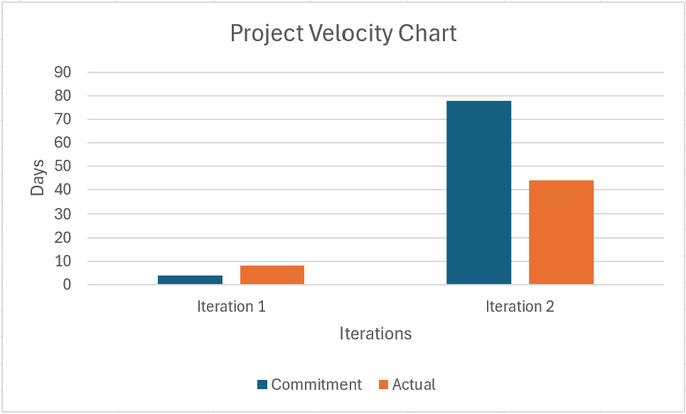

# Retrospective

This retrospective reflects on the feedback received from Iteration 2.

## 1. Challenges and Suggested Improvements

- **Time Estimates and Tracking:**
    - **Challenge:** In previous iterations, time estimates and the actual time spent on tasks were often missing or incomplete. This lack of documentation made it difficult to assess whether the team was accurately estimating and managing their time, leading to potential delays and inefficiencies.
    - **Improvement:** 
        - **Double-Check Times:** To address this, we will ensure that merge request reviewers verify the inclusion of both time estimates and actual time spent on each task. This step is essential for maintaining transparency and accountability within the team.
        - **Detailed Preplanning:** We will start Iteration 3 by estimating the time required for each task in detail.

- **Feature Completion:**
    - **Challenge:** We expected to complete more features during previous iterations. However, the focus on quantity may have detracted from the quality and user experience of the features delivered.
    - **Improvement:** In Iteration 3, we will prioritize the most impactful features that can significantly improve the user experience. Special attention will be given to features that enable users to seamlessly check out items, as this is a critical aspect of our app.

- **Coding Style and Documentation:**
    - **Challenge:** There were inconsistencies in coding style and documentation, which led to confusion and reduced the maintainability of the codebase.
    - **Improvement:** 
        - **Comments:** We will improve our documentation practices by ensuring that comments are added whenever a new non-trivial method is created. This will make the code more understandable and easier to maintain for future iterations.
        - **Code Formatting:** Consistent code formatting will be enforced through the use of linting tools. This will help maintain a uniform coding style across the project, reducing the likelihood of errors and improving code readability.

- **Coupling Between Presentation and Logic Layers:**
    - **Challenge:** There has been some unnecessary coupling between the presentation and logic layers, particularly related to null objects. This coupling can make the code harder to maintain and test.
    - **Improvement:** To resolve this, we will apply appropriate design patterns to decouple these layers. This will lead to a more modular and testable codebase, improving both development speed and code quality.

## 2. Improvement Strategies and Success Criteria

- **Refactor Code to Match Standards:**
    - **Strategy:** We will undertake a refactoring effort to align existing code with the coding standards established in Iteration 0. This will involve revisiting older code and making necessary adjustments to ensure consistency across the codebase.
    - **Success Criteria:** The success will be measured by the degree to which our code styles are consistent with the guidelines from Iteration 0. This consistency will enhance code readability, maintainability, and overall project quality.

- **Time Tracking Compliance:**
    - **Strategy:** We will implement a policy that requires every team member to document the time spent on tasks before their merge requests can be approved. This will ensure that time tracking becomes an integral part of our workflow.
    - **Success Criteria:** The success of this strategy will be evident when all tasks have documented time spent before approval, allowing for better tracking of project progress.

- **Collaborative Time Estimation:**
    - **Strategy:** During sprint planning, we will collaboratively set time estimates for each task. This detailed method will strengthen the team’s collective knowledge and lead to more accurate estimates.
    - **Success Criteria:** The success will be determined by the presence of time estimates recorded at the time of issue creation. Accurate time estimates will help in managing the team’s workload and meeting project deadlines.

- **Thorough Code Review Process:**
    - **Strategy:** Team members will be encouraged to conduct thorough self-reviews before submitting merge requests. Additionally, reviewers will be required to carefully scan through large merge requests for potential violations of coding standards.
    - **Success Criteria:** The success of this strategy will be indicated by a reduction in the need for necessary changes during the code review process. Minor issues like formatting or typos will be acceptable, but the overall quality of the code submitted should improve.

## 3. Project Velocity Chart

This project velocity chart compares our estimated days to the actual days that we took to complete Iteration 1 and 2.